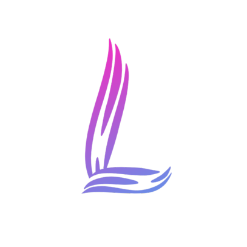

# B0TPY
<h3>Em versão Beta, porém totalmente utilizável!</h3>

  
  

  

    
    
    
  

  

    
    
  

[Top.gg](https://top.gg/bot/739265612051906721)

[Discords](https://discords.com/bots/bot/739265612051906721)

[InfiniteBots](https://infinitybots.gg/bot/739265612051906721)

[DiscordList](https://discordlist.gg/bot/739265612051906721)

[DiscordME](https://discord.me/lara-bot)

[Disforge](https://disforge.com/bot/3010-lara-bot)

<h5>A Equipe Lara B0T estará disponibilizando um código aberto de python para o desenvolvimento de bots, as diretrizes da licença MIT desse código permitem usar esse código livremente!</h5>

<h5>Quer contibuir ao projeto?</h5>
<h5>Você pode enviar sua contribuição via: github, discord ou e-mail: l4r4b0t@gmail.com</h5>

<h6>Apenas distribuimos o código, não nos responsabilizamos pelo uso do mesmo.</h6>
